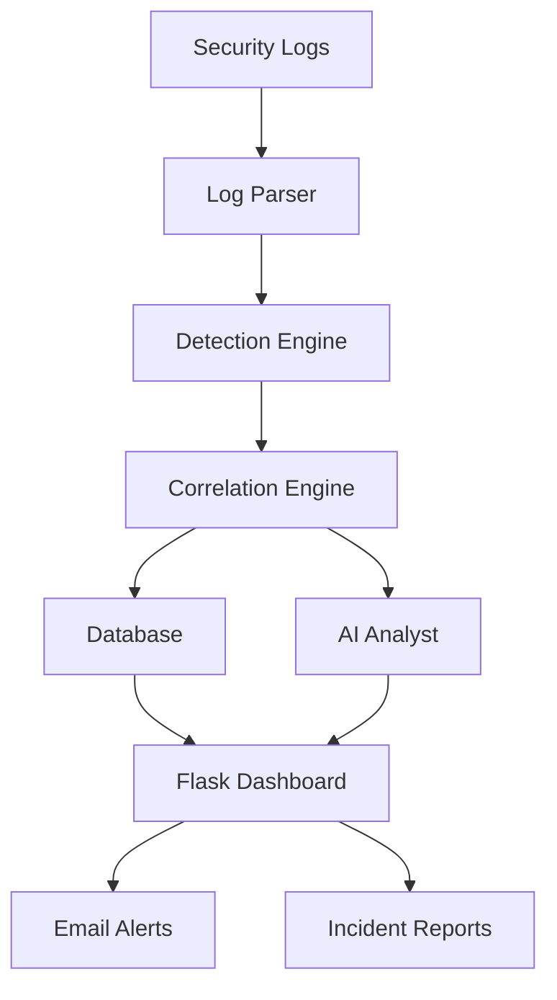
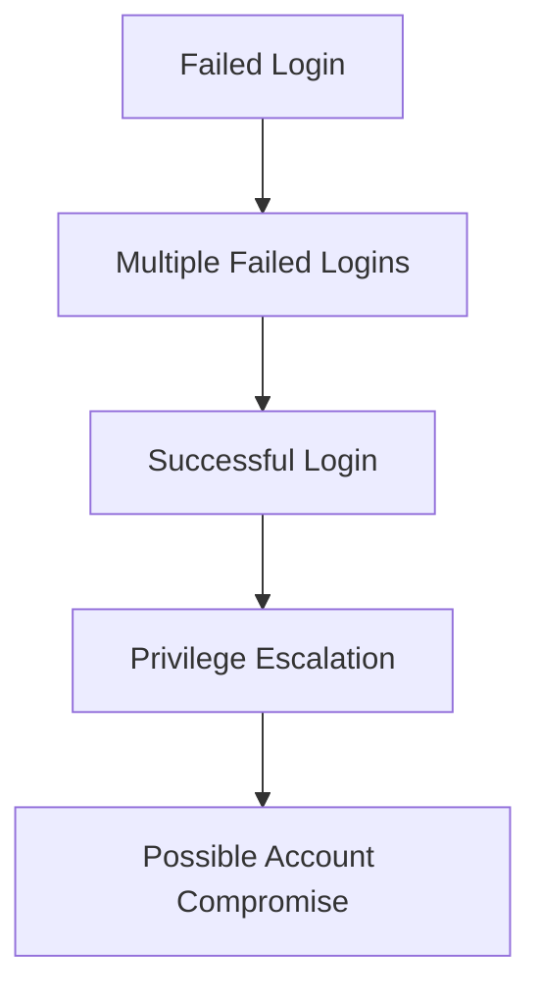

### 🛡️ SentinelIQ

> **An AI-Powered Security Information and Event Management (SIEM) Platform**

SentinelIQ is a lightweight, AI-assisted Security Information and Event Management (SIEM) platform built using Python and Flask. It collects and analyzes security logs, detects suspicious activities, correlates related events into meaningful incidents, and explains security threats in plain English using AI.

The project is designed for students, cybersecurity enthusiasts, and aspiring SOC analysts who want to understand how a modern SIEM works without the complexity of enterprise solutions.


## 🚀 Features

* 📥 Log Collection and Parsing
* 🔍 Threat Detection Engine
* 🔗 Event Correlation
* 🤖 AI Incident Analysis
* 📊 Interactive Web Dashboard
* 📧 Email Alerting
* 📝 Incident Report Generation
* 💾 SQLite Database Integration
* 🌐 Lightweight Flask Web Interface


## 🏗️ Project Architecture




## 📂 Project Structure

```text
SentinelIQ/
│
├── app.py
├── log_parser.py
├── detector.py
├── correlator.py
├── ai_analyst.py
├── database.py
├── emailer.py
├── report_generator.py
├── requirements.txt
├── sentineliq.db
├── install_sentineliq.ps1
├── run.bat
│
├── templates/
│   └── dashboard.html
│
├── static/
│
└── README.md
```


## ⚙️ Core Modules

### 📥 Log Parser (`log_parser.py`)

Responsible for collecting and normalizing security logs from different sources.

**Extracts information such as:**

* Timestamp
* Source IP
* Destination IP
* Username
* Event Type
* Status
* Protocol


### 🔍 Detection Engine (`detector.py`)

Applies security rules to identify suspicious activities.

**Detects:**

* Brute Force Attacks
* Multiple Failed Logins
* Port Scanning
* Suspicious Authentication
* Potential Malware Activity
* Unauthorized Access Attempts


### 🔗 Correlation Engine (`correlator.py`)

Individual alerts often lack context. The correlation engine combines related events into meaningful incidents.



This significantly reduces alert fatigue and improves investigation efficiency.


### 🤖 AI Analyst (`ai_analyst.py`)

Instead of showing technical alerts only, SentinelIQ explains incidents in human-readable language.

**Raw Alert**

```text
Rule 101 Triggered
```

**AI Explanation**

> Multiple failed login attempts followed by a successful authentication from the same IP address may indicate a brute-force attack. Review the affected account, verify login legitimacy, and consider resetting credentials if unauthorized.

> **Note:** This module calls an external LLM API to generate explanations. You'll need to supply your own API key — see [Configuration](#-configuration) below.


### 💾 Database (`database.py`)

Stores:

* Parsed Logs
* Alerts
* Incident History
* Detection Results
* Correlated Events

Current database:

```text
SQLite (sentineliq.db)
```


### 📊 Dashboard (`app.py` + `dashboard.html`)

The Flask dashboard provides a centralized interface for monitoring security events.

**Displays:**

* Recent Logs
* Active Alerts
* Detection Statistics
* Incident Timeline
* Security Status


### 📧 Email Alerts (`emailer.py`)

Automatically notifies administrators whenever critical incidents are detected. Requires SMTP credentials — see [Configuration](#-configuration).


### 📝 Report Generator (`report_generator.py`)

Generates incident reports containing:

* Incident Summary
* Severity
* Timeline
* Affected Assets
* AI Explanation
* Recommended Actions


## 🛠️ Tech Stack

| Technology | Purpose                   |
| ---------- | ------------------------- |
| Python     | Backend                   |
| Flask      | Web Framework             |
| SQLite     | Database                  |
| HTML5      | Frontend                  |
| CSS3       | Styling                   |
| JavaScript | Client-side Interactivity |


## 🚀 Installation

Clone the repository

```bash
git clone https://github.com/<your-username>/SentinelIQ.git
cd SentinelIQ
```

Create a virtual environment

```bash
python -m venv venv
```

Activate it

**Windows**

```bash
venv\Scripts\activate
```

**Linux / macOS**

```bash
source venv/bin/activate
```

Install dependencies

```bash
pip install -r requirements.txt
```

Run the application

```bash
python app.py
```

Open your browser

```text
http://127.0.0.1:5000
```


## 🔐 Configuration

Before running SentinelIQ, create a `.env` file in the project root with the following variables:

```env
# AI Analyst — LLM API credentials
AI_API_KEY=your_api_key_here
AI_MODEL=your_model_name_here

# Email Alerts — SMTP credentials
SMTP_SERVER=smtp.example.com
SMTP_PORT=587
SMTP_USERNAME=your_email@example.com
SMTP_PASSWORD=your_app_password
ALERT_RECIPIENT=admin@example.com
```


## 🎯 Roadmap

* [ ] Sigma Rule Support
* [ ] MITRE ATT&CK Mapping
* [ ] Threat Intelligence / IOC Enrichment
* [ ] REST API
* [ ] User Authentication & RBAC
* [ ] Docker Deployment

Longer-term ideas (CVE lookup, risk scoring, real-time log streaming, Elasticsearch integration, cloud log monitoring, AI chat assistant) are tracked in [Issues](../../issues) rather than listed here.


## 💡 Learning Objectives

This project demonstrates concepts including:

* Security Information and Event Management (SIEM)
* Log Parsing
* Event Correlation
* Threat Detection
* Incident Response
* AI-assisted Security Analysis
* Flask Web Development
* Database Management
* Python Programming


## 🤝 Contributing

Contributions are welcome. If you have ideas for new detection rules, dashboard improvements, AI enhancements, or bug fixes, feel free to fork the repository and submit a pull request.


## ⭐ Acknowledgements

* Python Community
* Flask Framework
* SQLite
* Open Source Cybersecurity Community
* MITRE ATT&CK Framework (for future mapping concepts)


## 📬 Contact

If you have any questions or suggestions regarding SentinelIQ, feel free to open an issue or start a discussion in this repository.


<p align="center">
  <b>🛡️ SentinelIQ — Turning Security Logs into Actionable Intelligence.</b>
</p>
