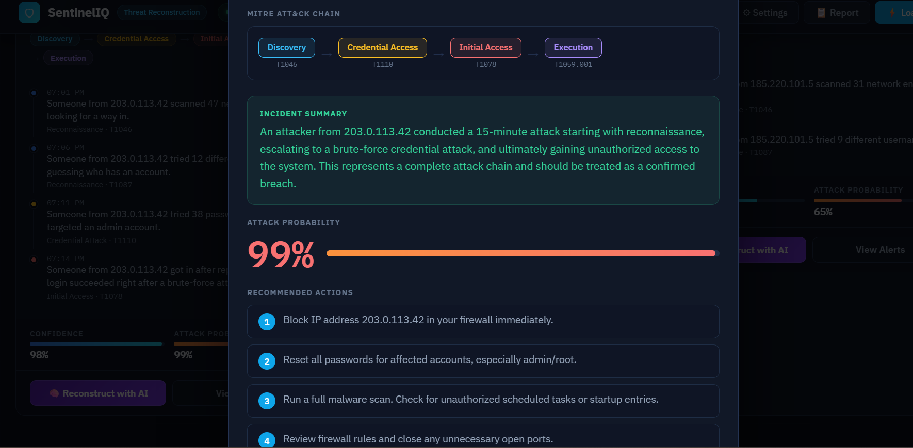

# 🤖 AI Security Analysis

SentinelIQ includes an AI-powered analyst that summarizes detected security events and helps users understand attacks more quickly.

Instead of reviewing every individual alert, the AI analyzes correlated incidents and produces a concise security summary with recommended actions.

# Features

The AI Analysis module provides:

- Attack summaries
- Threat assessment
- Recommended mitigation steps
- Security insights
- Overall incident overview

# How It Works

The AI analysis is performed after logs have been uploaded and processed.

Workflow:

1. Upload security logs or load demo data.
2. SentinelIQ parses the logs.
3. The detection engine identifies suspicious events.
4. Related alerts are correlated into incidents.
5. The AI Analyst generates a summary based on the detected activity.

# AI Summary

The AI Summary presents a high-level overview of detected attacks, allowing analysts to quickly understand the security situation.

Example:

- Number of detected attacks
- Attack severity
- Most common attack type
- Overall risk assessment
- Recommended next steps

# Detailed AI Analysis

The AI module also provides additional analysis and recommendations to help security analysts prioritize their response.

Typical recommendations include:

- Investigate suspicious IP addresses
- Block malicious sources
- Review authentication attempts
- Monitor affected systems
- Apply appropriate security controls

# Benefits

Using AI-generated summaries helps reduce the time required to review security events by highlighting the most important information first.

Key advantages include:

- Faster incident triage
- Improved situational awareness
- Easier investigation of correlated attacks
- Clear security recommendations
- Reduced manual analysis effort

# Typical Workflow

1. Upload or paste log data.
2. Generate security alerts.
3. Review incidents.
4. Open the AI Analysis section.
5. Read the generated summary and recommendations.
6. Continue the investigation or generate a security report.