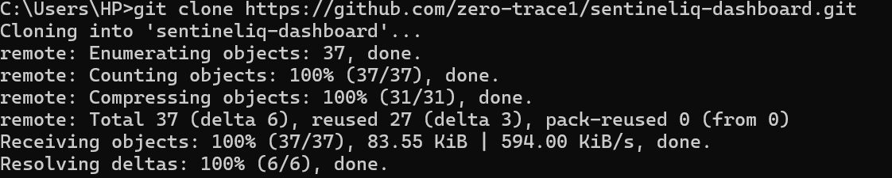
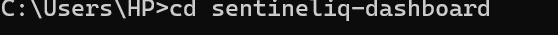
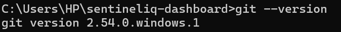
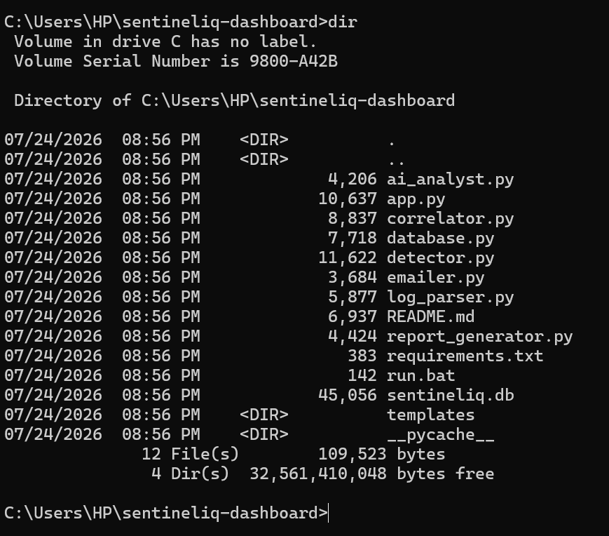
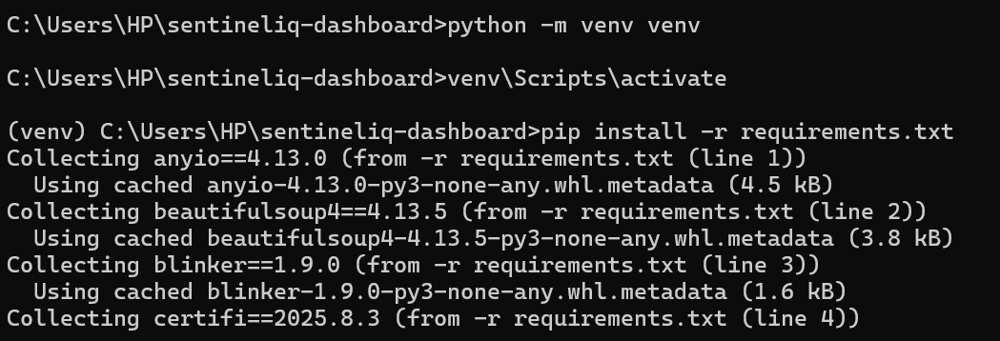
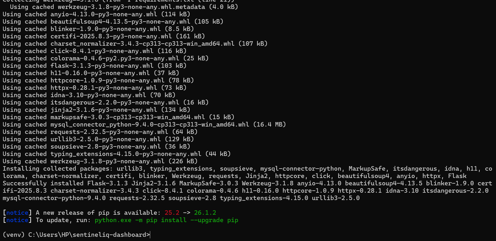
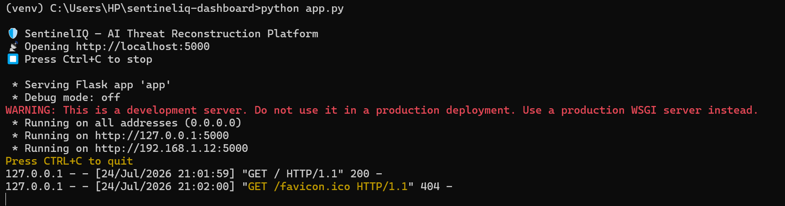
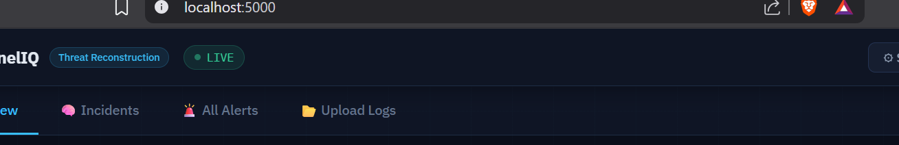

# 🚀 SentinelIQ Installation Guide

This guide walks you through the process of installing, configuring, and running **SentinelIQ** on a Windows system.

---

## Prerequisites

Before you begin, ensure the following software is installed:

- Git
- Python 3.11 or later
- pip (Python Package Manager)

---

## Step 1: Clone the Repository

Clone the SentinelIQ repository to your local machine.

```bash
git clone https://github.com/zero-trace1/sentineliq-dashboard.git
```

This command downloads the complete project to your computer.



---

## Step 2: Open the Project Directory

Navigate to the project folder.

```bash
cd sentineliq-dashboard
```



---

## Step 3: Verify Git Installation

Verify that Git is installed correctly.

```bash
git --version
```

If a version number is displayed, Git has been installed successfully.



---

## Step 4: Verify the Project Files

List the project files to confirm that the repository was cloned successfully.

```bash
dir
```

You should see important project files such as:

- `app.py`
- `detector.py`
- `log_parser.py`
- `requirements.txt`
- `README.md`



---

## Step 5: Create a Virtual Environment

Create a Python virtual environment.

```bash
python -m venv venv
```

Using a virtual environment isolates this project's dependencies from other Python projects installed on your system.

---

## Step 6: Activate the Virtual Environment and Install Dependencies

Activate the virtual environment and install all required Python packages.

```bash
venv\Scripts\activate
pip install -r requirements.txt
```

This command installs Flask and all other dependencies required by SentinelIQ.



---

## Step 7: Verify Dependency Installation

After installation completes successfully, you should see a confirmation similar to the screenshot below.



---

## Step 8: Start the Application

Launch the SentinelIQ application.

```bash
python app.py
```

The Flask development server will start.



---

## Step 9: Open the Dashboard

Once the server is running, Flask will display the local address.

```text
http://127.0.0.1:5000
```

Open this address in your web browser to access the SentinelIQ dashboard.



---

## ✅ Installation Complete

If the dashboard loads successfully, SentinelIQ has been installed correctly and is ready to use.

Continue to the **Usage Guide** to learn how to upload logs, analyze alerts, generate reports, and use the AI Analyst module.