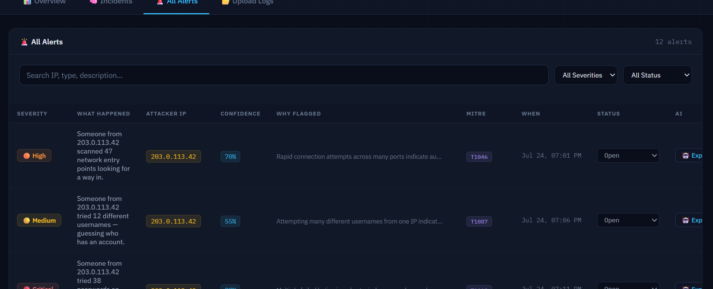
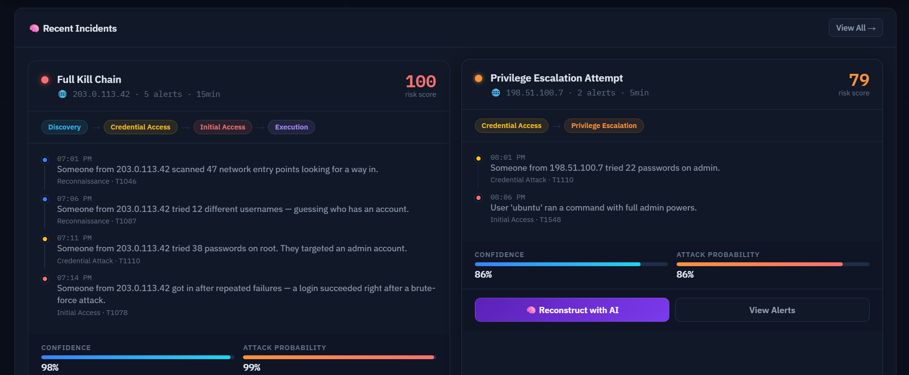
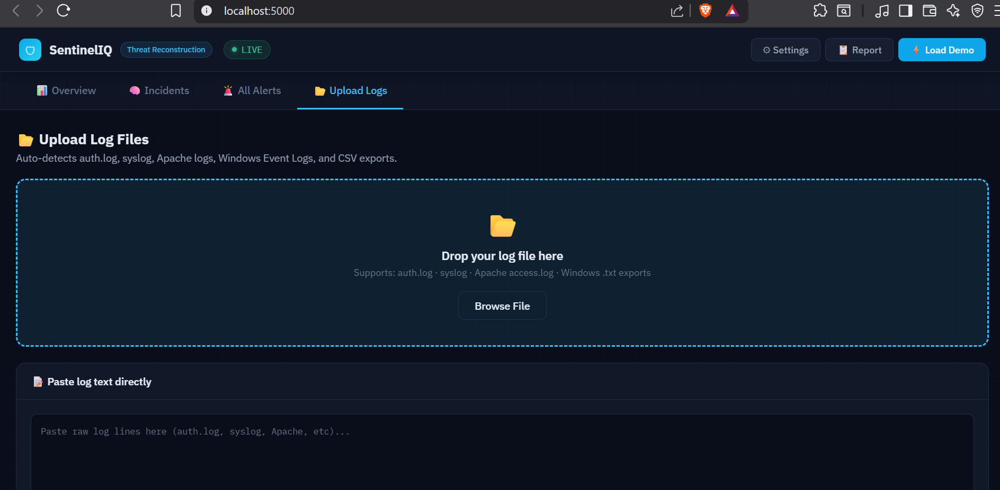
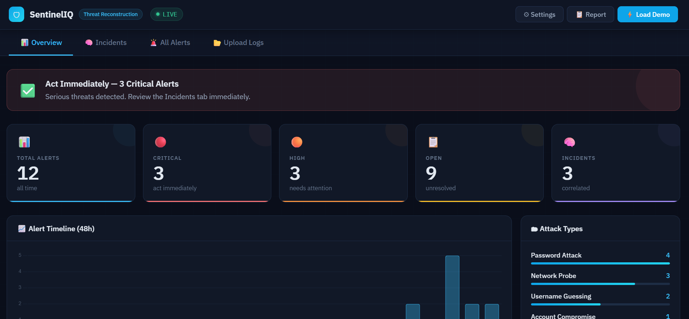
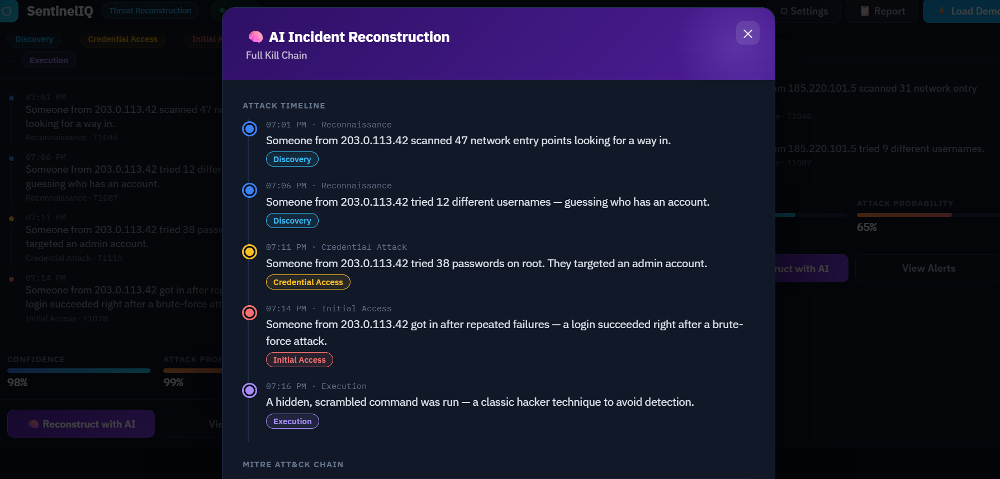
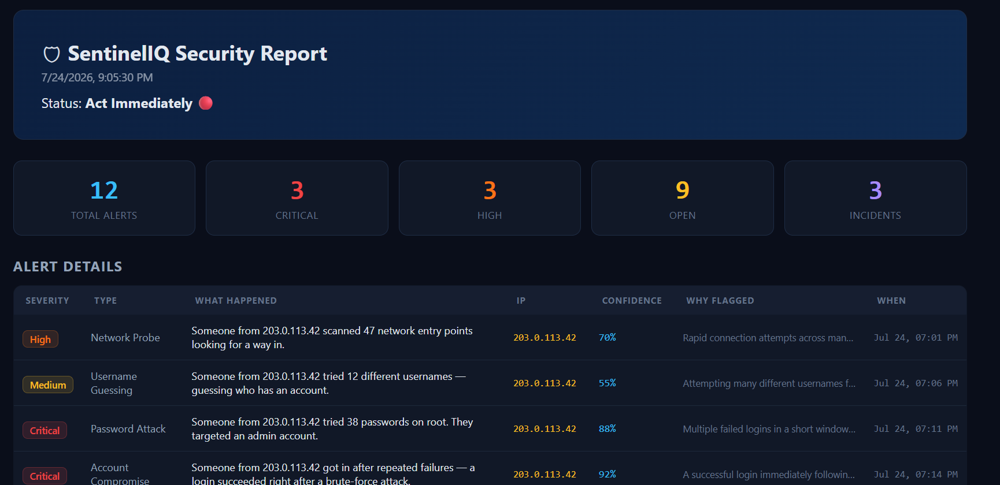

# 📖 SentinelIQ Usage Guide

This guide explains how to use SentinelIQ after installation.

# Dashboard Overview

After starting the application and opening `http://127.0.0.1:5000`, the SentinelIQ dashboard is displayed.

The dashboard provides:

- Security Overview
- Incidents
- Alerts
- Upload Logs
- AI Analysis
- Security Reports

# 1. View Security Alerts

Navigate to the **All Alerts** tab.

This page displays every detected security event generated by the detection engine.

Information includes:

- Alert severity
- Attack type
- Source IP
- Timestamp
- Status

# 2. Review Recent Incidents

Open the **Incidents** section.

This page groups related alerts into incidents, making it easier to investigate coordinated attacks instead of reviewing individual alerts.

# 3. Upload Log Files

Open the **Upload Logs** tab.

SentinelIQ supports multiple log formats, including:

- auth.log
- syslog
- Apache access logs
- Windows Event Logs
- CSV log exports

You can either:

- Drag and drop a supported log file
- Click **Browse File** to upload it manually

Uploaded logs are automatically parsed, analyzed, and processed by the detection engine.

# 4. Paste Raw Log Data

Instead of uploading a file, you can paste raw log entries directly into the text box.

Click **Analyze Logs** to process the pasted log data.

This is useful for testing or analyzing small sets of log entries.

# 5. Load Demo Data

Click **Load Demo** to generate realistic security events.

The demo populates the dashboard with sample alerts and incidents, allowing you to explore SentinelIQ without uploading real log files.

# 6. AI Security Analysis

Open the AI Analysis section to view automatically generated summaries.

The AI analyst provides:

- Attack summary
- Threat assessment
- Recommended actions
- Security insights

# 7. Generate Security Reports

Click **Report** in the top navigation bar.

SentinelIQ generates a structured incident report containing detected attacks and analysis results.

# Typical Workflow

1. Upload or paste security logs.
2. Allow SentinelIQ to parse and analyze the logs.
3. Review generated alerts.
4. Investigate related incidents.
5. Read the AI-generated security summary.
6. Export a security report.